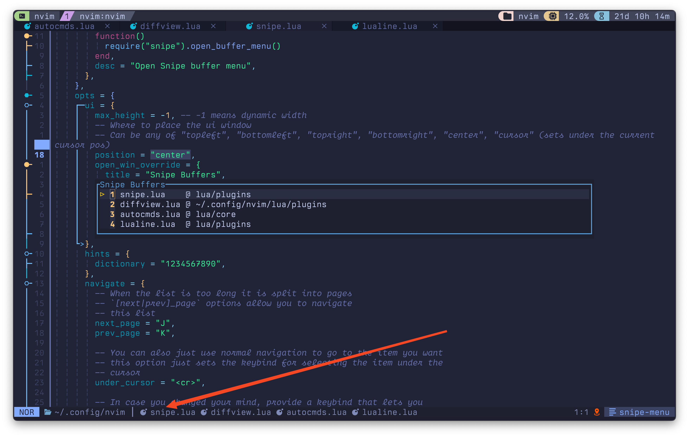

# snipe-lualine-files.nvim

A lualine component to show snipe buffers

## how to use

```lua

  {
    "nvim-lualine/lualine.nvim",
    dependencies = {
      "nicholasxjy/snipe-lualine-files.nvim",
      dependencies = {
        "leath-dub/snipe.nvim",
        "echasnovski/mini.icons" --optional
      },
    },
    opts = function(_, opts)
      opts.sections = opts.sections or {}
      opts.sections.lualine_c = opts.sections.lualine_c or {}
      local snipe_lualine_files = require("snipe-lualine-files")
      table.insert(opts.sections.lualine_c, {
        snipe_lualine_files.lualine_component,
      })
    end,
  },

```

## snapshot


